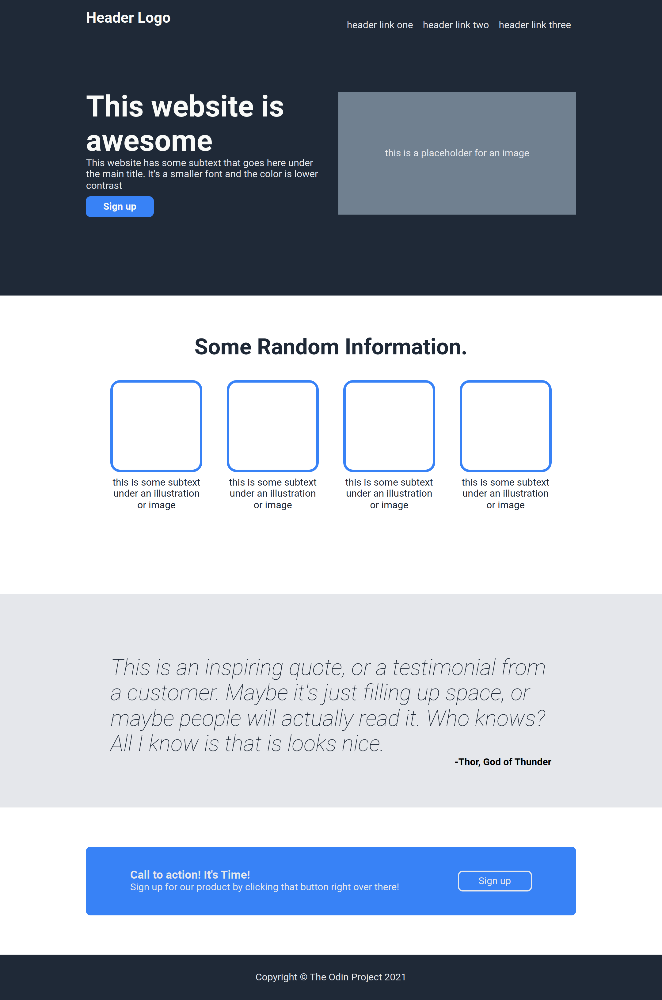
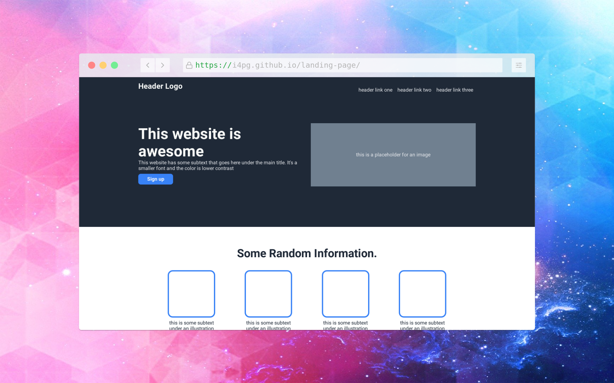

# Landing Page
- [Live Demo](https://i4pg.github.io/landing-page/)

## Description
- The Landing Page Project is an exciting web development project that helps you learn HTML and CSS by creating a captivating landing page. You'll build a visually appealing page from scratch, using different design elements like layout, fonts, colors, and images.

## Screenshot
### Original

### My attempt

## Thoughts 💭
In this project, I got to practice and improve my skills with the flexbox property. I learned how to use different flexbox properties like align-items and justify-content. I also learned how to arrange elements on a webpage and use HTML semantic elements effectively. Working with flexbox parent and children became much easier for me as I gained more experience through this project.

## NOTE
I used [CSS Variables](https://www.w3schools.com/css/css3_variables.asp) for easier mock-up [reference](https://cdn.statically.io/gh/TheOdinProject/curriculum/81a5d553f4073e593d23a6ab00d50eef8620796d/foundations/html_css/project/imgs/02.png)

## Tech Used 💻

